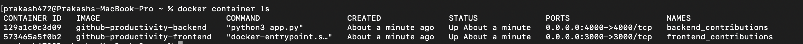

# Developer Productivity
This project aims to build a simple report that indicates the productivity of teams (individual engineers/contributors) against a single repository over time.

# Objective
The objective of this project is to collect the data efficiently, ensure accuracy of data over time, and provide usable output to non-technical consumers.

# MVP features
- Retrieve contributors information for a given repository
- Retrieve commits information for a given repository
- Calculate the productivity score for each contributor
- Generate a report that indicates the productivity of contributors against a single repository over time

# Approach
The project collects data from the GitHub API, calculates productivity scores for each contributor, and generates a report in JSON format. The Flask framework is used to build the API endpoints that retrieve the necessary data from GitHub and generate the report. Frontend is entirely built in the React. Various Dashboards are added for viewing the results efficiently. Docker is used to containerize the application for easy deployment.

Here, the productivity of the contributors is a difficult task to find out. For these, reasons different metrics were taken and a collective commit score was calculated to determine the productivity of the users. Here, the metrics like number of commits, the commits made for refactor or the commits made to fix any issues were considered and a collective scores was calculated.

# Technical and Design Aspects
- Backend Developed with the Flask Framework of Python
- Frontend Developed with the React Framework with tailwind css.
- React charts were used to make the non-technical person understand the contributions of the contributor.
- Containerized the fronend and backend as separated containers using Docker. This helps to scale the system in future.


## Deployment

The most simple way would be using the docker if docker is present.

```bash
git clone https://github.com/prakash472/github-productivity.git
cd github-productivity
docker-compose up
```
The app will run and we can go on http://localhost:3000 to see our application.

However, if docker is not present. Then we have to run the both backend and frontend separatly on different servers.

We need to have node installed in our system

```bash
cd frontend
npm install
npm start
```
The frontend will be serving in http://localhost:3000 we can visit the frontend from here.

For backend we go to the backend folder.

``` bash
pip3 install requirements.txt
python3 app.py
```

# Limiations
 - Here, the github api only allows the 60 requests per hour per user from originating IP address. Due to this getting the entire contributions API would be difficult. We will easily face API rate limit. Due, to this by default per page it allows 30 results. The project has also shown for the first 30 contributions for the repository. Some features could not be implemented because of the API limitations.
 
 - Identifying the productivity of a contributor in a github can be a challanging task. The metrics like number of commits, frequency of commits, addition or deletion of the number of files could not quantify the impact of the contributor. Hence, calculating the overall impact might be a difficult task.

# Future features
- Include additional metrics to determine the productivity of contributors, such as code quality and testing
- Allow for comparison of productivity across different repositories and teams

# Conclusion
This project provides a simple and efficient way to generate a productivity report for GitHub repositories. The code can be easily modified and extended to include more features and metrics to enhance the report's usability and appeal.
## Screenshots


